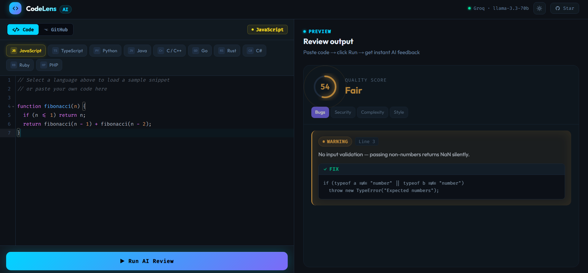
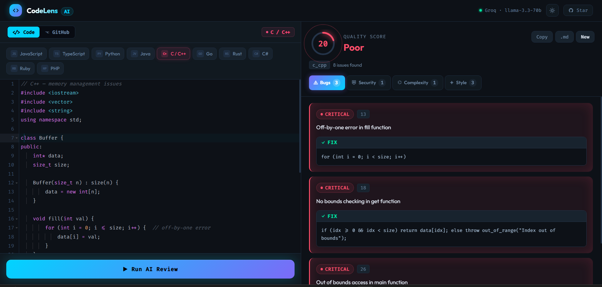

<div align="center">

<br/>


# CodeLens — AI Code Review

### Paste code. Get instant AI feedback. Ship better software.

[](https://code-tester-ai.netlify.app)
&nbsp;
[](https://ai-code-review-kukl.onrender.com/api/health)
&nbsp;
[](https://console.groq.com)
&nbsp;
[](https://github.com/vikash1311/ai-code-review/stargazers)

<br/>

> A **full-stack AI tool** that reviews code for bugs, security vulnerabilities, complexity issues,
> and style improvements — across **10 programming languages** — in seconds.
> Built end-to-end: REST API, AST parsing, AI integration, and a polished React UI. Deployed to production.

<br/>

</div>

---

## 📸 Preview

<table>
<tr>
<td width="50%">

**JavaScript Review — Bug Detection**
Score badge · Severity cards · Actionable fixes



</td>
<td width="50%">

**C/C++ Review — Memory Management Analysis**
Language-specific snippet auto-loads on pill click



</td>
</tr>
</table>

---

## ⚡ Features

| | Feature | Detail |
|---|---|---|
| 🤖 | **AI-Powered Review** | Groq `llama-3.3-70b` — fast, free, production-grade |
| 🐛 | **Bug Detection** | Logic errors, off-by-one, null refs, silent failures |
| 🔒 | **Security Scanning** | SQL injection, exposed secrets, plain-text passwords |
| ⚙️ | **Complexity Analysis** | Real cyclomatic complexity via acorn AST (not guesswork) |
| 🎨 | **Style Review** | Naming, documentation, idiomatic patterns |
| 📊 | **Quality Score** | 0–100 score with animated ring — Good / Fair / Poor |
| 🌐 | **GitHub URL Mode** | Paste any public GitHub file URL — auto-fetches and reviews |
| 💡 | **Language Snippets** | Click any language → loads real buggy sample code |
| 🌙 | **Theme Toggle** | Dark / light mode with smooth 250ms transitions |
| 📥 | **Export** | Download review as Markdown or copy to clipboard |

---

## 🏗️ System Architecture

```
┌──────────────────────────────────────────────────────────┐
│                   BROWSER  (Netlify)                      │
│                                                           │
│   CodeEditor.jsx         ReviewOutput.jsx                 │
│   ├─ react-ace editor    ├─ Score badge (animated ring)   │
│   ├─ 10 language pills   ├─ Bugs / Security / Complexity  │
│   ├─ GitHub URL toggle   ├─ Style tabs                    │
│   └─ Run AI Review CTA   └─ Copy · Download · New         │
│                                                           │
│              reviewApi.js  (fetch wrapper)                │
└─────────────────────────┬────────────────────────────────┘
                          │  HTTPS POST
                          ▼
┌──────────────────────────────────────────────────────────┐
│              NODE.JS + EXPRESS  (Render)                  │
│                                                           │
│  POST /api/review/code        POST /api/review/github     │
│         │                            │                    │
│         ▼                            ▼                    │
│   astParser.js              githubFetcher.js              │
│   • acorn AST (JS/TS)       • URL → raw.githubusercontent │
│   • regex fallback          • axios + 404/403 handling    │
│   • 500-line guard          • ext → language detection    │
│         │                            │                    │
│         └──────────────┬─────────────┘                    │
│                        ▼                                  │
│                 openaiService.js                          │
│                 • Structured prompt                       │
│                 • Groq API · llama-3.3-70b                │
│                 • JSON mode · temp 0.2                    │
│                 • Normalise + validate response           │
└──────────────────────────────────────────────────────────┘
```

---

## 🛠️ Tech Stack

**Frontend**

- React 18 + Vite + Tailwind CSS v4
- `react-ace` — syntax-highlighted code editor
- 10 language modes with preloaded real-world buggy snippets
- Native capture-phase keyboard event handling (Ctrl+A/C/V fix)

**Backend**

- Node.js + Express — stateless, no database
- `acorn` — AST parsing for exact cyclomatic complexity (JS/TS)
- Regex fallback parser for Python, Go, Java, Rust, C#, Ruby, PHP
- `axios` — GitHub raw file fetching with proper error handling

**AI**

- Groq Cloud — `llama-3.3-70b-versatile` (100% free, 14,400 req/day)
- JSON mode enforced — structured output every time
- Temperature 0.2 — consistent, deterministic reviews

**Infrastructure**

- Frontend → **Netlify** (auto-deploy from GitHub, CDN)
- Backend → **Render** (auto-deploy from GitHub, free tier)
- CORS configured for multi-origin (local dev + production)

---

## 🚀 Local Setup

```bash
# 1. Clone
git clone https://github.com/vikash1311/ai-code-review.git
cd ai-code-review

# 2. Backend
cd backend
cp .env.example .env
# → Get a FREE Groq API key at console.groq.com
# → Add it to .env: OPENAI_API_KEY=gsk_...
npm install && npm run dev      # http://localhost:8080

# 3. Frontend  (new terminal)
cd frontend
echo "VITE_API_BASE_URL=http://localhost:8080" > .env
npm install && npm run dev      # http://localhost:5173
```

**Test the API:**
```bash
curl -X POST http://localhost:8080/api/review/code \
  -H "Content-Type: application/json" \
  -d '{"code":"function add(a,b){return a+b}","language":"javascript"}'
```

---

## 📁 Project Structure

```
ai-code-review/
│
├── backend/
│   ├── src/
│   │   ├── index.js                   # Express · CORS · error handler
│   │   ├── routes/
│   │   │   └── review.js              # POST /code · POST /github · GET /health
│   │   └── services/
│   │       ├── openaiService.js       # Groq prompt + JSON parsing + normaliser
│   │       ├── astParser.js           # acorn AST (JS/TS) + regex fallback
│   │       └── githubFetcher.js       # URL converter + axios fetch
│   ├── .env.example
│   └── package.json
│
└── frontend/
    ├── src/
    │   ├── App.jsx                    # Root · split layout · theme state
    │   ├── api/reviewApi.js           # fetch wrapper for both endpoints
    │   └── components/
    │       ├── CodeEditor.jsx         # react-ace + 10 language snippets
    │       ├── ReviewOutput.jsx       # Tabs · score · loading · error states
    │       ├── IssueCard.jsx          # Severity badge + fix code block
    │       └── ScoreBadge.jsx         # SVG ring with glow animation
    ├── .env.example
    └── package.json
```

---

## 🔑 Engineering Highlights

**Why these decisions matter to a recruiter:**

| Decision | Problem Solved |
|---|---|
| `acorn` AST over regex for JS/TS | Exact branch counting — regex overcounts, AST doesn't |
| Groq instead of OpenAI | Zero cost, same SDK interface — smart resource choice |
| JSON mode + response normaliser | Eliminates parsing failures in production |
| Stateless backend | No DB ops = faster responses, simpler deployment |
| 500-line guard pre-AI call | Saves API tokens, prevents abuse, keeps latency low |
| Capture-phase keyboard listeners | Fixes react-ace eating Ctrl+A/C/V — detail that matters |
| Multi-origin CORS via env var | Works for local dev AND production without code changes |

---

## 📡 API Reference

```
GET  /api/health
     → { status: "ok" }

POST /api/review/code
     Body: { code: string, language?: string }
     → { language, overall_score, bugs[], security[], complexity[], style[] }

POST /api/review/github
     Body: { url: string }   # public GitHub blob URL
     → { language, overall_score, bugs[], security[], complexity[], style[], source_url }

Response shape per issue:
     { severity: "Critical|Warning|Suggestion", description, line, fix }
```

---

## 🌐 Live Deployment

| Service | URL |
|---|---|
| **Frontend** | https://code-tester-ai.netlify.app |
| **Backend API** | https://ai-code-review-kukl.onrender.com |
| **Health Check** | https://ai-code-review-kukl.onrender.com/api/health |

> ⚠️ Render free tier sleeps after 15 min of inactivity — first request may take ~30s to wake up.

---

<div align="center">

## 👨‍💻 Built by Vikash Gautam

Full-stack developer. Built this entire project — backend, frontend, AI integration, deployment — end to end.

<br/>

[](https://linkedin.com/in/vikash2808)
&nbsp;
[](https://github.com/vikash1311)
&nbsp;
[](https://code-tester-ai.netlify.app)

<br/>

**If this project impressed you, drop a ⭐ — it helps more than you think.**

<br/>

*Made with 🧠 AI + ☕ caffeine*

</div>
